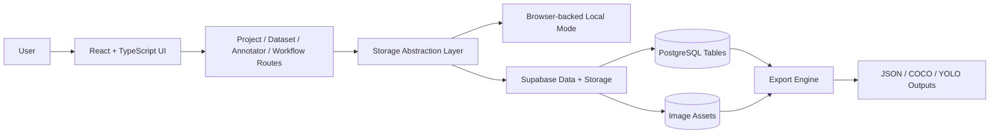

# AnnotatOR

A computer vision dataset and annotation platform built with React, TypeScript, and Supabase. This repo is the strongest product-style project in the portfolio because it combines dataset management, annotation workflows, export tooling, and a public dataset hub in one system.

**Status:** MVP in progress  
**Stack:** React, TypeScript, Tailwind CSS, Vite, Supabase, React Flow, React Konva  
**Focus:** Product engineering, storage abstraction, CV workflow design

## Why this project

AnnotatOR explores what a lightweight, modern CV platform looks like when dataset operations, annotation, workflow building, and public sharing live in a single interface. The main engineering challenge is keeping the system flexible enough to support both cloud-backed and local-style workflows without collapsing into feature sprawl.

## Core capabilities

- Create computer vision projects for detection, classification, and segmentation.
- Upload, organize, split, annotate, and export image datasets.
- Build visual preprocessing and export workflows with a drag-and-drop editor.
- Publish datasets to a browseable public hub with likes and forks.

## Architecture list

1. Interface layer
   a. React pages for projects, datasets, annotation, workflows, and the public hub  
   b. Shared layout, routing, charts, and form interactions
2. Application layer
   a. Storage abstraction for cloud mode and browser-backed local mode  
   b. Dataset, class, annotation, and workflow operations
3. Data layer
   a. Supabase tables for projects, images, annotations, classes, workflows, and public datasets  
   b. Migrations for review status, attribution, and base policies
4. Export and sharing layer
   a. JSON project bundles  
   b. COCO and YOLO dataset export

## Implementation diagram



## Project structure

```text
AnnotatOR/
├── src/
│   ├── components/         # Shared layout and module UI
│   ├── lib/storage/        # Cloud/local storage abstraction
│   ├── pages/              # Product screens
│   ├── types/              # Shared TypeScript models
│   └── App.tsx             # Routing entry point
├── supabase/migrations/    # Schema and policy evolution
├── QUICK_START.md
├── DEPLOYMENT.md
└── README.md
```

## Tech stack

- `React 18` + `TypeScript` for the application shell
- `Tailwind CSS` for styling
- `React Router` for navigation
- `React Konva` for annotation canvas interactions
- `React Flow` for workflow composition
- `Supabase` for persistence and storage
- `Vite` for local development and builds

## Local setup

```bash
npm install
cp .env.example .env
npm run dev
```

Add your Supabase credentials to `.env` before starting the app:

```env
VITE_SUPABASE_URL=https://your-project.supabase.co
VITE_SUPABASE_ANON_KEY=your-anon-key
```

## Current state

**Implemented**

- Cloud/local storage switching
- Project, dataset, class, annotation, workflow, and public dataset flows
- Import/export support
- Review-status and attribution migrations
- Passing `typecheck`, `build`, and `lint`

**Next**

- Authentication and account flows
- Stronger Supabase RLS policies
- Better binary asset round-tripping
- Realtime collaboration and sync
- Performance hardening and bundle splitting

## Why it matters in this portfolio

This repo best represents full product thinking: interface design, typed frontend architecture, schema design, storage decisions, and a feature set that feels like a real tool instead of a single demo screen.
